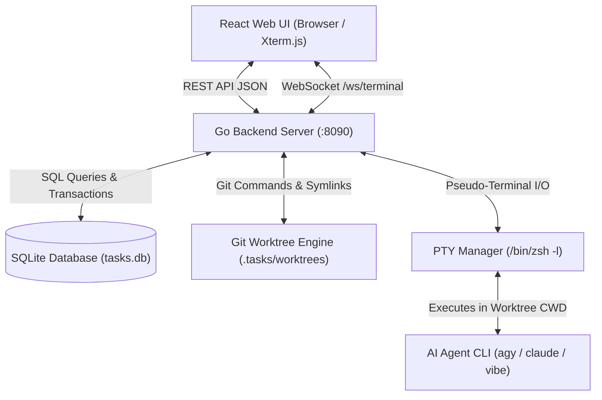

# Architecture & System Design

This document details the software architecture, design patterns, internal subsystems, and data flows of **TaskFlow**.

---

## 1. High-Level Architecture

TaskFlow is designed as a lightweight, single-binary capable full-stack application consisting of:
1. **Backend Go Server (`cmd/server`)**: High-performance HTTP REST API, background task queue worker, Git worktree manager, and WebSocket PTY pseudo-terminal server.
2. **Frontend React SPA (`web/`)**: Modern TypeScript Single Page Application featuring Kanban drag-and-drop, interactive list views, Git diff inspection, chat drawer, and embedded Xterm.js terminal emulator.
3. **Embedded SQLite Database (`tasks.db`)**: Zero-configuration, ACID-compliant local database storing projects, tasks, activities, comments, and settings.
4. **Git Worktree Isolation Engine**: Dedicates a clean, branch-isolated physical filesystem directory (`.tasks/worktrees/<taskKey>`) per task, ensuring concurrent task development without dirtying the main working tree.
5. **Agent CLI Orchestration Engine**: Integrates natively with AI coding agents via subprocess execution and interactive PTY sessions.



---

## 2. Backend Go Architecture

The backend is structured under Go standard packaging conventions:

```
cmd/server/main.go            # Entry point, router setup, static asset handler
internal/
├── db/
│   └── db.go                 # SQLite access layer, queue runner, worktree logic, schema
├── handlers/
│   ├── handlers.go           # HTTP REST endpoints & WebSocket terminal proxy
│   └── handlers_test.go      # Integration and unit tests
├── models/
│   └── models.go             # Data transfer objects and domain models
├── runner/
│   ├── runner.go             # Subprocess execution, dynamic PATH resolver, CLI finder
│   └── runner_test.go        # Subprocess runner unit tests
└── terminal/
    └── terminal.go           # Interactive PTY Manager (creack/pty + WebSockets)
```

### 2.1 Concurrency Model & Lock Discipline

The `db.DB` struct manages concurrent read and write operations against SQLite using a `sync.RWMutex`:
- **Read Operations**: Protected by `d.mu.RLock()`.
- **Write Operations**: Protected by `d.mu.Lock()`.
- **Internal Helper Rule (`Unsafe` methods)**:
  > [!IMPORTANT]
  > To prevent self-deadlocks (e.g. holding a write lock while calling a method that acquires a read lock), internal private helper methods that execute queries without acquiring locks are suffixed with `Unsafe` (such as `getProjectsUnsafe()`, `getSettingsUnsafe()`, `getProjectByIDUnsafe()`). Public API methods acquire the lock and call these unsafe helpers.

### 2.2 Dynamic Binary & Environment Resolution

TaskFlow does **not** hardcode user home directories or fixed binary paths. `internal/runner/runner.go` provides:
- `GetDynamicCustomPath()`: Dynamically discovers the user's home directory and compiles standard executable paths:
  `~/.local/bin`, `/opt/homebrew/bin`, `/usr/local/bin`, `/usr/bin`, `/bin`, `~/go/bin`, `~/.cargo/bin`.
- `FindCliTool(tool string)`: Dynamically searches `PATH` and fallback directories for `agy`, `claude`, `vibe`, `git`, etc.

---

## 3. Git Worktree Isolation & Skill Propagation

### 3.1 Worktree Lifecycle

When a task requires execution (via AI skill or Interactive Terminal), `EnsureTaskWorktree` is called:
1. Validates that the project `repo_path` is a valid Git repository.
2. Ensures that `.tasks/` is appended to `.gitignore` so temporary worktrees are never committed.
3. Computes the target Git branch name (e.g. `TASK-1-implement-some-feature`).
4. Checks if `.tasks/worktrees/<taskKey>` already exists:
   - If valid, checks out the target branch.
   - If corrupted or mismatched, removes and prunes the worktree.
5. Spawns `git worktree add <worktreePath> -b <branchName> <baseBranch>`.

### 3.2 Automatic Symlink & Skill Injection

To make the worktree fully functional immediately without re-downloading dependencies or losing project configurations, the engine automatically symlinks:
- `.env*` (execution environement).
- `.agents/`, `.taskflow/` (agent configurations, skills, and memory).
- Automatically writes default skill files (`clarify-issue`, `specify-issue`, `code-issue`, `create-pr`, `pick-issue`) `.agents/skills/` within the worktree.

---

## 4. Interactive PTY & WebSocket Subsystem

The terminal subsystem (`internal/terminal/terminal.go`) gives the browser a true interactive login shell:

1. **PTY Session Creation (`creack/pty`)**:
   - Spawns the user's login shell (`$SHELL` or `/bin/zsh -l`).
   - Sets the working directory (`Dir`) to the task's worktree.
   - Injects contextual environment variables:
     - `TASKFLOW_TASK_ID` (and legacy `TASKACAO_TASK_ID`): Unique task UUID.
     - `TASKFLOW_TASK_KEY` (and legacy `TASKACAO_TASK_KEY`): Task human key (e.g. `TASK-1`).
     - `TASKFLOW_TASK_BRANCH` (and legacy `TASKACAO_TASK_BRANCH`): Active task branch.
     - `TASKFLOW_TASK_WORKTREE` (and legacy `TASKACAO_TASK_WORKTREE`): Absolute worktree path.
2. **Circular Output Buffer**:
   - Maintains a 64KB circular replay buffer per session so that reconnecting browser tabs immediately see the latest terminal output.
3. **Bi-directional WebSocket Streaming (`/ws/terminal?taskId=...`)**:
   - **Incoming Client Frames**:
     - Raw keystrokes / ANSI sequences are written directly to the PTY master file descriptor.
     - JSON control messages (e.g. `{"type": "resize", "cols": 120, "rows": 35}`) invoke `pty.Setsize()`.
   - **Outgoing Server Frames**:
     - Streamed as binary or text frames directly to the Xterm.js frontend instance.

---

## 5. Background Queue Worker

TaskFlow includes an autonomous in-process background worker:
- Monitored via a Go channel `d.queueChan`.
- Fetches `queued` activities from SQLite in FIFO order.
- Executes the designated AI skill or script in the task worktree.
- Updates activity status (`running` → `completed` | `failed`) and captures stdout/stderr in the activity record.
