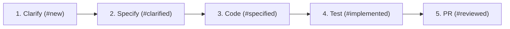

# Core Capabilities & Workflows

This document outlines the functional capabilities, workflow engines, and AI orchestration pipelines provided by **Taskacao**.

---

## 1. Multi-Project Workspace Management

Taskacao supports multiple concurrent software repositories and projects from a single unified dashboard:

- **Isolated Project Configurations**:
  - `repo_path`: Local filesystem path to the project repository.
  - `git_remote_url`: Remote Git repository URL.
  - `issue_tracker`: Tracker provider (`linear`, `github`, `jira`, or `local`).
  - `stage_mapping`: Custom mapping between Taskacao workflow stages and external tracker states.
  - `skill_overrides`: Project-specific prompt template overrides.

- **Dynamic Workspace Switcher**:
  - The UI allows filtering tasks by project (`All Projects` vs individual projects).
  - When creating or editing tasks, the task is strictly bound to its parent project, automatically inheriting tracker properties and working directories.

---

## 2. Issue Tracker Abstraction Layer

Taskacao provides a unified domain model over four issue sources

- Local (SQLite) : Native SQLite Storage for full offline support.
- Linear : through linear CLI (https://github.com/schpet/linear-cli)
- Jira : through `acli`
- Github : through `gh`

---

## 3. Autonomous AI Skill Pipeline

Taskacao orchestrates tasks through a five-stage progressive development lifecycle:

### Stage 1: Clarification (`clarify-issue` / `/clarify`)
- **Objective**: Identifies functional gaps, edge cases, and architectural ambiguities.
- **Output**: Generates structured questions for the human developer. Answers can be appended directly to the story description or posted back to Linear/GitHub.

### Stage 2: Technical Specification (`specify-issue` / `/specify`)
- **Objective**: Generates an actionable, implementation-ready technical specification (Speckit standard).
- **Output**: Stores markdown specification with system diagrams, API contracts, modified files list, and test requirements.

### Stage 3: Implementation (`code-issue` / `/code`)
- **Objective**: Implements the required code changes directly inside the task's isolated Git worktree.
- **Output**: Edits codebase, verifies build, prepares clean atomic commits.

### Stage 4: Automated Testing (`/test`)
- **Objective**: Executes unit tests, linter checks, and compile steps.
- **Output**: Validates zero regressions before code review.

### Stage 5: Pull Request Generation (`create-pr` / `/pr`)
- **Objective**: Pushes the branch to remote origin and opens a PR with a structured changelog.
- **Output**: Pull Request URL attached to the task card and external issue tracker.

---

## 4. Interactive ZSH Pseudo-Terminal (PTY Live)

For hands-on pair programming and manual debugging:
- Spawns an interactive login shell (`/bin/zsh -l`) in the task's dedicated worktree directory.
- Features Xterm.js emulation with full ANSI colors, cursor control, and keyboard navigation.
- Injects task context variables (`$TASKACAO_TASK_KEY`, `$TASKACAO_TASK_WORKTREE`).
- Action toolbar provides one-click triggers:
  - **`⚡ Run agent`**: Starts interactive conversation with the chosen agent.
  - **`/clarify`**, **`/specify`**, **`/code`**, **`/create-pr`**: Executes prompt skills natively in shell.
  - **`Ctrl+C`**: Sends interrupt signal to running processes.
  - **`Reset`**: Gracefully terminates and respawns a fresh shell.

---

## 5. Live Git Diff & Branch Management

- **Side-by-Side & Inline Git Diff Inspector**: Displays real-time file diffs between the active task branch and `main` using syntax highlighting.
- **Branch Checkout & Worktree Switcher**: Allows the developer to switch their main editor CWD or inspect the worktree directory in one click.
- **Auto-Pruning**: Safely removes worktrees when tasks are marked as finished or deleted.
