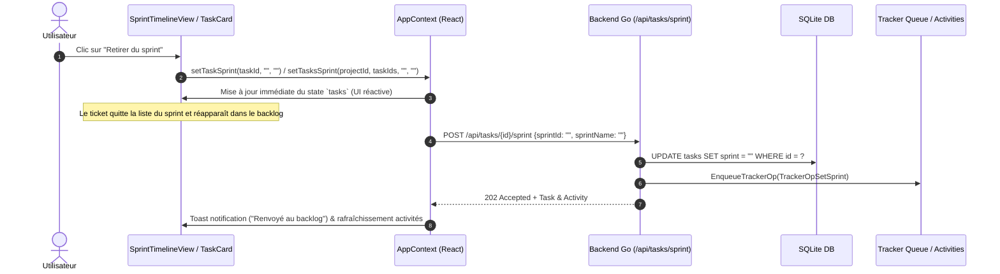

# Technical Design: Retirer des tickets d'un sprint dans la vue Sprint

## Technical Overview
La désattribution d'un ticket de son sprint consiste à réinitialiser la propriété `sprint` (ainsi que l'identifiant du sprint associé) à une chaîne vide (`""`) ou `null`. Cette opération est déjà supportée par le backend SQLite via `d.SetTaskSprint(id, "", "")` et `d.SetTasksSprint(projectID, taskIDs, "", "")`, appelés par les endpoints API `POST /api/tasks/{id}/sprint` et `POST /api/projects/{id}/sprint-move`.

Le travail de design s'articule principalement autour des composants Frontend React (`SprintTimelineView.tsx` et `TaskCard.tsx`) afin de rendre cette action accessible, intuitive et réactive à tous les endroits clés de l'interface.

## Architecture & Data Flow

## Component Modifications

### 1. `TaskCard.tsx` Context Menu (`...`)
- **Modification** : Inspection de `task.sprint`. Si `task.sprint` est non vide, ajouter une option dans le menu contextuel déroulant (`MoreHorizontal`) :
  - **Label** : "Retirer du sprint"
  - **Icône** : `<X size={12} className="text-amber-400" />` ou `<Archive size={12} />`
  - **Action** : Appeler `setTaskSprint(task.id, '', '')` puis fermer le menu et afficher un toast d'information.

### 2. `SprintTimelineView.tsx` Individual Actions
- **Mode Compact - Vue Cartes** :
  - Dans la liste des cartes du sprint (quand `isBacklogOpen` est `false`), ajouter un bouton d'action rapide "Retirer du sprint" sur chaque ligne/carte avec une icône de retrait (ex: `<X size={11} />` ou bouton textuel/infobulle).
- **Mode Compact - Vue Chips** :
  - Dans la vue par puces (chips), inclure un bouton de suppression/désattribution sur chaque chip au survol ou au clic droit.
- **Mode Planification - Vue Cartes & Chips** :
  - Consolider le bouton de retrait individuel sur les cartes et chips déjà présent en mode planification et assurer son accessibilité.

### 3. `SprintTimelineView.tsx` Batch Action (Sélection Multiple)
- **Selection State** : `checkedTaskIds` conserve les identifiants des tâches sélectionnées.
- **Batch Action Bar** :
  - Dans la barre d'action par lot des tâches sélectionnées (au sein d'un sprint ou globale), inclure un bouton "Retirer du sprint" / "Renvoyer au backlog".
  - **Action** : Appeler `setTasksSprint(currentProject.id, selectedIds, '', '')`.

## Backend & API Integration
- `POST /api/tasks/{id}/sprint` avec payload `{"sprintId": "", "sprintName": ""}` :
  - Enregistre `sprint = ""` en base SQLite.
  - Crée une activité `TrackerOpSetSprint` ciblée sur `"backlog"`.
- `POST /api/projects/{id}/sprint-move` avec payload `{"taskIds": [...], "sprintId": "", "sprintName": ""}` :
  - Enregistre `sprint = ""` pour l'ensemble des tickets de la liste en SQLite.
  - Crée une activité de lot `TrackerOpSetSprint` ciblée sur `"backlog"`.

## Rejected Alternatives
1. **Confirmation modale systématique pour chaque retrait** :
   - *Rejeté* : Ralentit la saisie et le réajustement du sprint. Un toast réactif avec mise à jour immédiate à l'écran offre une meilleure expérience utilisateur.
2. **Glisser-Déposer comme unique moyen de retrait** :
   - *Rejeté* : Le glisser-déposer exige que le panneau latéral du backlog soit ouvert et n'est pas pratique sur écrans tactiles ou petits affichages.
